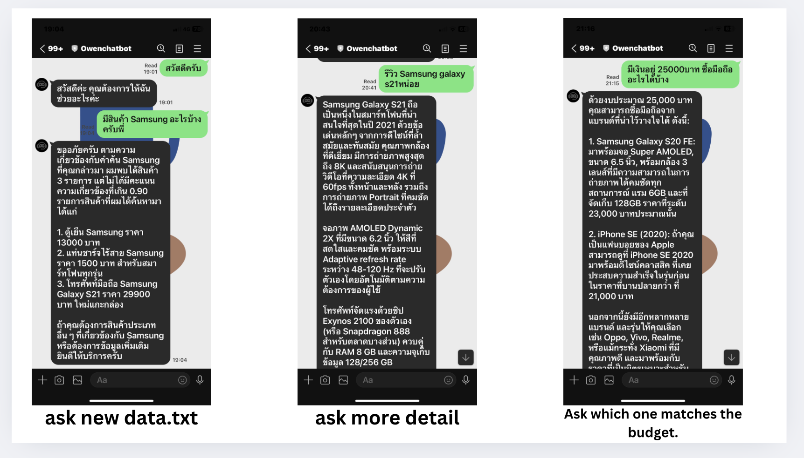
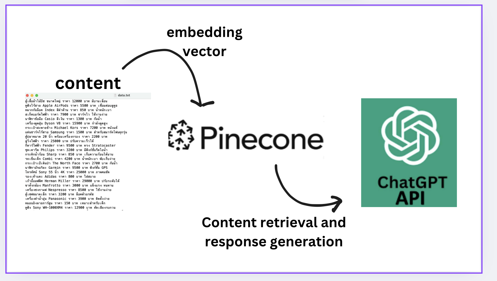

# LINE RAG AI Assistant



summary of the chatbot's abilities as demonstrated in the conversation:
- Product Inquiry Handling: The chatbot can provide information and recommendations on Samsung products, including prices and features which from augument data (data.txt)
- Product Reviews: It can give detailed reviews of specific products, highlighting key features and specifications.
- Budget-Based Recommendations: The chatbot can suggest products within a given budget, offering options from various brands.

This project, inspired by a workshop originally designed for Go, has been converted to Python for enhanced robustness and user-friendliness in conversational applications. It is about building a LINE chatbot integrated with a Retrieval-Augmented Generation (RAG) AI model, using Python and various libraries. If you want to learn more, please enroll in this course: [Workshop Link](https://www.eventpop.me/e/58009/workshop-building-bot-rag-go?fbclid=IwY2xjawGpeAxleHRuA2FlbQIxMQABHWxUbt5KuGgzGoJnRHruWdbS97flDKMbUz-n1LPy8WjMNtd5-hg8MNszuw_aem_ZRqI9GyWxzP2fzNACAfNqw).

### Example Workflow

1. A user sends a message to the LINE chatbot.
2. The webhook receives the message and triggers the appropriate handler.
3. For text messages, embeddings are generated, and Pinecone is queried for similar items.
4. The results from Pinecone and the user's input are used to generate a response using OpenAI GPT.
5. The generated response is sent back to the user through the LINE messaging API.



### Key Components

1. **Flask Framework**: Creates a web server that listens for incoming webhook events from LINE and handles requests.
2. **Pinecone**: A vector database that stores and queries vectors (embeddings) representing text data, helping find the most similar items based on the input query.
3. **OpenAI GPT**: Generates chat responses and handles user interactions using context and embeddings to provide relevant responses.
4. **ngrok**: Securely exposes local servers to the internet.
5. **Environment Variables**: Managed using `dotenv` to securely handle API keys and other configurations.
6. **LINE Webhook**: Connects your chatbot to the LINE messaging platform, enabling real-time message processing.

### Major Functionalities

1. **Initialization**:
   - **Loading Environment Variables**: Uses `dotenv` to securely manage keys and configurations.
   - **Pinecone Initialization**: Sets up the Pinecone client and connects to an existing index or creates one if it does not exist.

2. **Webhook Handling**:
   - **Event Processing**: The `handle_webhook` function processes incoming events from LINE and dispatches them to appropriate handlers based on the event type.
   - **Message Handling**: Different handlers like `handle_text_message`, `handle_image_message`, etc., process specific types of messages. For text messages, embeddings are created, Pinecone is queried for similar results, and a response is generated using the GPT model.

3. **Embedding and Querying**:
   - **Embedding Generation**: The `get_embeddings` function generates vector embeddings for the input text using OpenAI's embedding models.
   - **Pinecone Querying**: Queries the Pinecone database to find the most similar vectors based on the input embeddings.

4. **Response Generation**:
   - **Chat Response**: Uses OpenAI GPT to generate a contextual response based on the user's input and the retrieved similar items from Pinecone.

### Steps to Get Started

0. **install python environment**

```bash
pip install -r requirements.txt
   ```

1. **Create a `.env` file** in the root directory of this project (you can copy this or rename `.env.example` to `.env`) and type your token or api here:

   ```plaintext
   OPENAI_API_KEY=
   CHANNEL_ID=
   CHANNEL_SECRET=
   PORT=
   INDEX_NAME=
   PINECONE_API_KEY=
   PINECONE_ENV=
   ```

2. **Run the Application**:

   ```bash
   python main.py
   ```

3. **Expose Local Server using ngrok**:

   ```bash
   ngrok http 3001
   ```

4. **Configure LINE Chatbot**:
   - Go to the Messaging API settings in the LINE developer console.
   - Copy the `ngrok` URL and add `/webhook` to it, then save it.

   Example:

   ```plaintext
   https://abc1-123-123-123-12.ngrok-free.app/webhook
   ```
